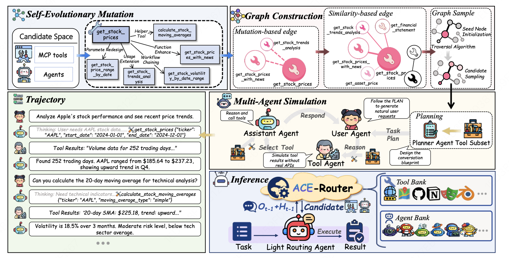

<div align="center">

# ACE-Router: Generalizing History-Aware Routing from MCP Tools to the Agent Web

**Accepted to ACL 2026 Main Conference (Oral)**

[[Paper]](https://arxiv.org/abs/2601.08276) [[Project Page]](https://euyis1019.github.io/ACE-Router/)

</div>

## Overview

With the rise of the **Agent Web** and **Model Context Protocol (MCP)**, the agent ecosystem is evolving into an open collaborative network, exponentially increasing accessible tools. However, current architectures face severe scalability and generality bottlenecks.

We propose **ACE-Router**, a pipeline for training **history-aware routers** to empower precise navigation in large-scale ecosystems. By leveraging a dependency-rich candidate graph to synthesize multi-turn trajectories, we effectively train routers with dynamic context understanding to create the plug-and-play **Light Routing Agent**.

<div align="center">

</div>

### Key Highlights

- **Self-Evolutionary Graph Construction** -- Expands and structures the candidate space via mutation and relation modeling.
- **Multi-Agent Simulation** -- Synthesizes interaction trajectories to extract history-aware supervision signals.
- **Light Routing Agent** -- A plug-and-play module that seamlessly integrates the trained router into existing agent pipelines.
- **Cross-domain Transferability** -- A router trained solely on tool data generalizes to multi-agent collaboration with minimal adaptation.
- **Robustness & Scalability** -- Maintains exceptional robustness against noise and scales effectively to massive candidate spaces.

## 🚀 News

- **[2026-05-13]** We released the code and paper for ACE-Router.
- **[Coming Soon]** Data and model weights will be released. Stay tuned!

## Code

The inference and evaluation code is now available under [`AceRouter/`](AceRouter/). See [`AceRouter/README.md`](AceRouter/README.md) for setup, the smoke test, and how to plug in your own router model.

```bash
cd AceRouter
conda create -n toolace python=3.11 -y && conda activate toolace
conda install -c conda-forge nodejs -y
pip install -e .
```

## 🙏 Acknowledgement

- [MCP-Universe](https://github.com/SalesforceAIResearch/MCP-Universe): For the evaluation framework and benchmarks.
- [MCPMark](https://github.com/eval-sys/mcpmark): For the evaluation benchmarks.
- [LLaMA-Factory](https://github.com/hiyouga/LLaMA-Factory): For the SFT implementation.
- [Qwen](https://github.com/QwenLM/Qwen): For the powerful base models.

## Citation

```bibtex
@misc{acerouter2026,
  title={ACE-Router: Generalizing History-Aware Routing from MCP Tools to the Agent Web},
  author={Zhiyuan Yao and Zishan Xu and Yifu Guo and Zhiguang Han and Cheng Yang and
          Shuo Zhang and Weinan Zhang and Xingshan Zeng and Weiwen Liu},
  year={2026},
  eprint={2601.08276},
  archivePrefix={arXiv},
}
```
